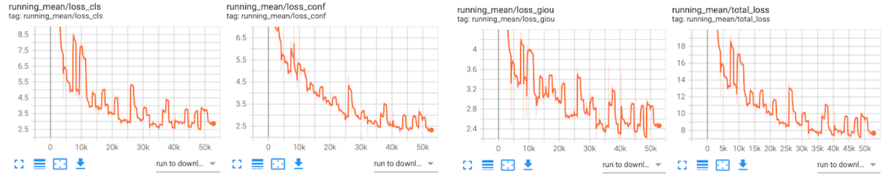

### Task 1  Image Classification

We implement **ResNet-50** to conduct the image classification on **CIFAR100** dataset.

The performanceof ResNet-50 with different data augmentation methods is shown below.

| model              | accuracy  | f-measure |   change   |
| ------------------ | :-------: | :-------: | :--------: |
| ResNet-50          |   63.27   |   63.07   |     -      |
| ResNet-50 + cutout |   65.89   |   65.84   |   + 2.77   |
| ResNet-50 + cutmix |   67.26   |   67.27   |   + 4.20   |
| ResNet-50 + mixup  | **74.58** | **74.46** | **+11.39** |

#### Train

To reproduce our experiment results, do the following steps.

1. Download `task-1` and create `datasets/cifar` . Your file tree should looks like

```shell
.
task-1/
	pkg/
	main.py
	...
datasets/
	cifar/
```

2. Install necessary packages.

```shell
pip install -r requirements.txt
```

3. **Train.**

```shell
cd task-1
```

```shell
# No data augmentation
python main.py --classifier 'resnet50' --batch-size 1024 --data-aug ''

# With ata augmentation
python main.py --classifier 'resnet50' --batch-size 1024 --data-aug <cutmix|cutout|mixup>
```
We record the loss by tensorboardx during traning, you can visualize the learning curve (i.e. ResNet-50 + mixup) like this.


#### Evaluate

Downloard trained model weight from [here](https://pan.baidu.com/s/1sJ9knZG0WJQgs0HZ7NcJfw) with extract code $\text{\color{blue}6epb}$, then run

```shell
python main.py --mode "eval" --classifier 'resnet50' \
	--save-path <path-to-saved-weights>
```


### Task 2  Object Detection


We implement **YOLOv3** to conduct the object detection on **PASCAL VOC2007** dataset. 

Note that we train the model on VOC2007trainval + VOC2012trainval and evaluate on VOC2007test.

The performance of is

| Metrics                | $AP_{25}$ | $AP_{50}$ | $AP_{75}$ |
| -------------- | :-------: | :-------: | :-------: |
| YOLOv3  |   80.15   |   78.44   |   37.82   |
| + multi-scale training |   83.86   |   82.13   |   41.57   |
| + mixup  |   **87.70**   |   **84.24**   |   **46.93**   |

#### Train

To reproduce our experiment results, do the following steps.

1. Download `task-2-yolov3` and create `datasets/voc` . 

   Download VOC datasets and put them into `datasets/voc` like this.

```shell
.
task-2-yolov3/
	pkg/
	preprocess_voc.py
	train.py
	test.py
	...
datasets/
	voc/
		VOC2007/
			Annotations/
			ImageSets/
			JEPGImages/
			...
		VOC2012trainval/
			Annotations/
			ImageSets/
			JEPGImages/
			...
```

2. Download [pre-trained darknet weights](https://pjreddie.com/media/files/darknet53_448.weights) and put it into ```task-2-yolov3/pretrained``` directory.
3. Install necessary packages.

```shell
pip install -r requirements.txt
```

4. Pre-process the VOC datasets.

```shell
cd task-2-yolov3 && python preprocess_voc.py
```

4. **Train.**

```shell
python train.py
```

We record the loss by tensorboardx, you can visualize the learning curve like this.




#### Evaluate

Download trained model weights from [here](https://pan.baidu.com/s/1YIIQAI_bCGiXI_eSsxpnFA) with extract code $\text{\color{blue}c63g}$, then run

```shell
python test.py \
	--weight-path <path-to-weight-file> \
	--conf-thresh 0.1 --iou-thresh 0.50 --eval
```


